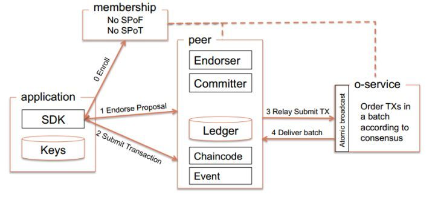
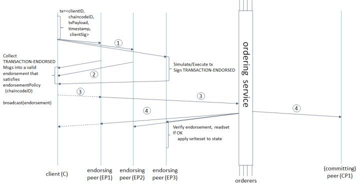

## Fabric基本认识

### 基本架构

[官方文档](http://hyperledger-fabric.readthedocs.io/en/master/arch-deep-dive.html)

上图为fabric的基本结构图，以下解释各名词含义。

+ application: 提供各种语言的SDK接口
+ membership： 也就是fabric-ca，提供成员服务，用来管理身份，提供授权和认证
+ peer: 负责模拟交易和记账
  - Endorser(背书)，peer执行交易并返回yes/no
  - Committer，将验证过的区块追加到通道上各个账本的副本
  - Ledger，账本
  - chaincode，用来编写业务逻辑，交易指令用来修改资产，可以理解为fabric网络对外提供的一个交易接口（智能合约）
  - Event是fabric提供的一个事件框架，比如链代码事件，拒绝事件，注册事件等，在编写代码的时候可以订阅这些事件来实现自己的业务逻辑。
+ o-service用来实现共识

区块链运行称之为链码（chaincode）的程序，保存状态、账本数据，并执行交易。链码是中央元素，因为交易是在链码上调用的操作。交易必须被“endorsed”，而且只有被“endorsed”后的交易才能被提交。管理方法和参数可能存在一个或多个特殊链码，统称为系统链码。

**交易**可能有两种类型：

- 部署事务，创建新的链接代码并将程序作为参数。当部署事务成功执行时，链代码已经安装在区块链上。
- 调用事务，在先前部署的链式代码的上下文中执行操作。一个invoke事务引用了一个chaincode和它提供的函数之一。成功时，chaincode执行指定的功能 - 可能涉及修改相应的状态并返回输出。

如后面所述，部署事务是调用事务的特例，其中创建新链代码的部署事务对应于系统链代码上的调用事务。

**State**，区块链的最新state被建模为版本化的键值存储（KVS），修改由运行在区块链上的链码（applications）调用KVS的put,get操作。详细的操作与版本化暂时略，看文档有点没看懂..State由peers进行维护，而不是orders和clients。KVS中的Keys可以从它们的名称中识别出属于特定的链码，因此只有特定链码的交易可以修改这个链码上的keys，但原则上，任何链码都可读别的链码的keys，即读取方便，但修改需特权。

**Ledger, 账本**，账本提供了发生在系统运行时的所有成功和不成功交易的历史。账本，作为总的区块总的哈希链（成功或不成功），由订阅服务构造。哈希链强制要求在账本中所有的有序区块以及每个块包含1个完全有序的交易，这在所有交易中强制要求所有的订阅。账本保存在所有的peer中，并可选择性的存放在orders中。在orders中，我们指的账本是OrdererLedger(总账)；在peers中，我们指的是PeerLedger（分账），分账和总账的区别在于peers本地会维护一个位掩码，这个位掩码会将有效的事务从无效的当中分离出来。peers可能会对分账进行修剪，orders负责维护总账的容错性和可用性并且可以随时修剪，前提是ordering服务的属性得到维护。账本允许peers重播所有交易的历史以及重建state,所以state是一个可选的数据结构。

**节点**，节点是区块链中的通信实体，节点只是一个逻辑功能，因为不同类型的多个节点可以在同一台物理服务器上运行，重要的是节点在“信任域”中如何分组并与控制它们的逻辑实体相关联。节点分为3种类型：

+ Client 或 submitting-client: 提交真正交易给endorsers的客户，并且广播交易申请给ordering服务
+ Peer：提交交易并维护state和账本的备份，除此之外，peers还有一个特殊的endorser角色
+ Ordering-service-node或者order：通信服务 -> 实现传递保证，例如原子性或者所有的order广播

订阅服务提供了一个共享的通信通道给clients和peers, 提供的是一个包含交易信息的广播服务。client连接到通道，在通道中广播消息，消息将会送达给所有的peers。通道支持所有消息的原子性传递，即，消息通信是按序传递和可靠的。换句话说，通道给所有连接的peers输出的是相同消息，且是相同的逻辑顺序。这种原子性的通信保证在分布式系统中也被称为全序广播，原子广播，或者是共识。传递的消息是包含在区块链状态中的候选交易。

#### 交易流程

交易过程如下：

1. Application向一个或多个peer节点发送对交易的背书请求。
2. Peer的endorse执行背书，但并不将结果提交到本地账本，只是将结果返回给应用。
3. 应用收集所有背书节点的结果后，将结果广播给orderers，orderers执行共识，生成block，通过消息通道批量的将block发布给peer节点，更新lerdger。

交易过程可如下图

#### channel

channel是构建在Fabric网络上的私有区块链，实现了数据的隔离和保密。channel是由特定的peer所共享的，并且交易方必须通过该通道的正确验证才能与账本进行交互。

可以看到不同颜色的channel隔离了不同的peer之间的通信。

Fabric提供了一个first-network的<u>demo</u>来学习整个流程。要学哦! 入手做一个~等理论搞定，明天能不能搞定理论 fabric的~ 

今天理论到一半了吧.. 然而又读不下去了，真的超枯燥...我先搞一下别的。

first-network有两个组织，每个组织各有两个个peer节点，以及一个排序服务。两个peer节点无法达成共识，三个peer节点无法容错，四个peer节点刚好完成演示。